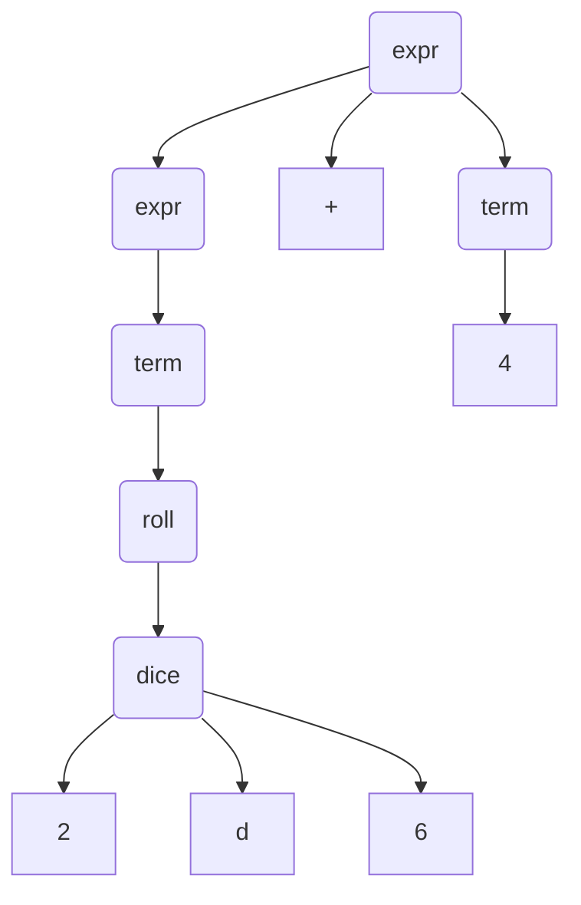
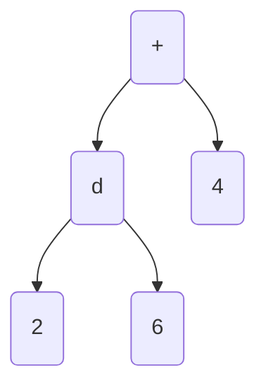
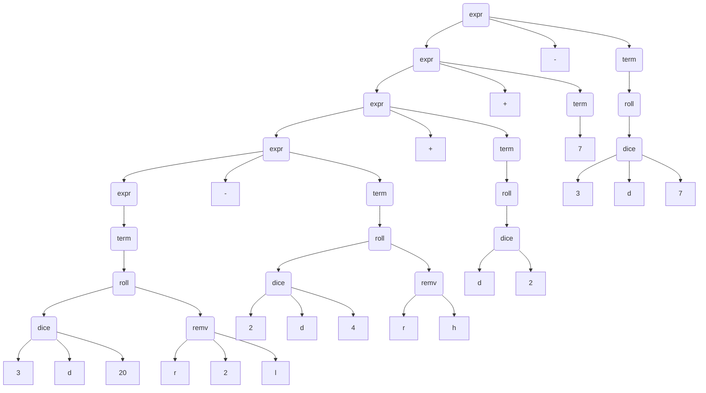
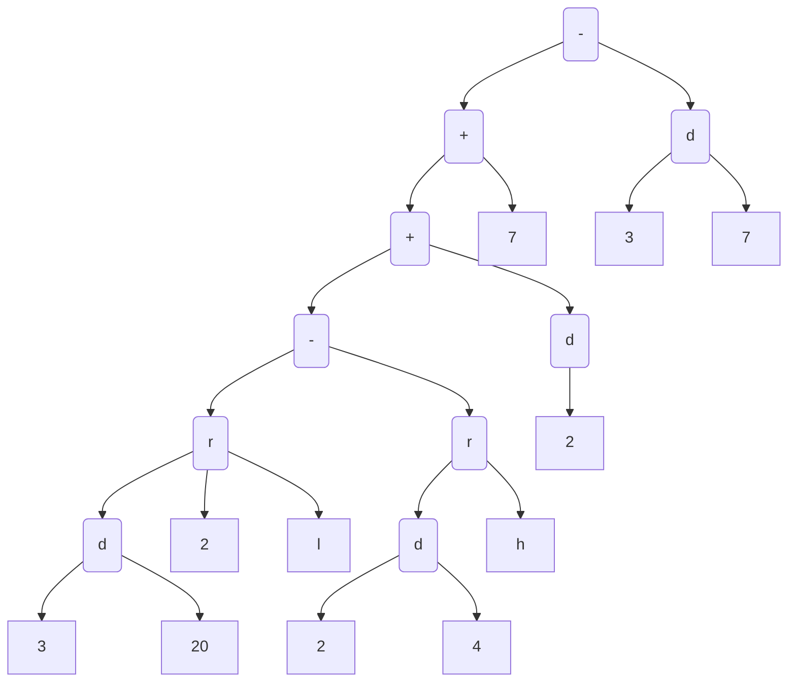

# Grammar
## Human Forms
- `1` -> 1
- `d6` -> Roll 1d6
- `1d8` -> Roll 1d6
- `2d6 + 4` -> Roll 2d6, add 4
- `1d6 + 2d4` -> Roll 1d6, add 2d4
- `1d6 + 1d4 + 2` -> Roll 1d6, add 1d4, add 2
- `d20 - 2d4` -> Roll 1d20, subtract 1d4
- `1d20 - 1d4 + 2` -> Roll 1d20, subtract 1d4, add 2
- `2d20rl + 2` -> Roll 1d20 and remove 1 lowest, add 2
- `5d6r2l` -> Roll 5d6 and remove 2 lowest
- `2d20rh + 1` -> Roll 2d20 and remove 1 highest, add one

## Context Free Grammar
### Terminals
| Symbol | Meaning                            | Lexeme Examples |
|--------|------------------------------------|-----------------|
| INT    | Any non-negative, non-zero integer | 1, 23, 4        |
| DIE    | Dice indicator                     | d               |
| REM    | Removal indicator                  | r               |
| DIR    | Removal direction, low or high     | l, h            |
| ADD    | Addition operator                  | +               |
| SUB    | Subtraction operator               | -               |

### Language Rules
```txt
expr -> expr ADD term | expr SUB term | term
term -> dice REM INT DIR | dice REM DIR | dice | INT
dice -> INT DIE INT | DIE INT
```
### Translations of Human Form Examples
| Human Form       | Reduced CFG Form                      |
|------------------|---------------------------------------|
| `1`              | `INT`                                 |
| `d6`             | `DIE INT`                             |
| `1d6`            | `INT DIE INT`                         |
| `2d6 + 4`        | `INT DIE INT ADD INT`                 |
| `1d6 + 1d4 + 2`  | `INT DIE INT ADD INT DIE INT ADD INT` |
| `d20 - 2d4`      | `DIE INT SUB INT DIE INT`             |
| `1d20 - 1d4 + 2` | `INT DIE INT SUB INT DIE INT ADD INT` |
| `2d20rl + 2`     | `INT DIE INT REM DIR ADD INT`         |
| `5d6r2l`         | `INT DIE INT REM INT DIR`             |
| `2d20rh + 1`     | `INT DIE INT REM DIR ADD INT`         |

### Parse Tree Examples

#### 2d6 + 4
##### CFG Form

##### Code Form


#### 3d20r2l - 2d4rh + d2 + 7 - 3d7

Code Form
3d20r2l - 2d4rh + d2 + 7 - 3d7
